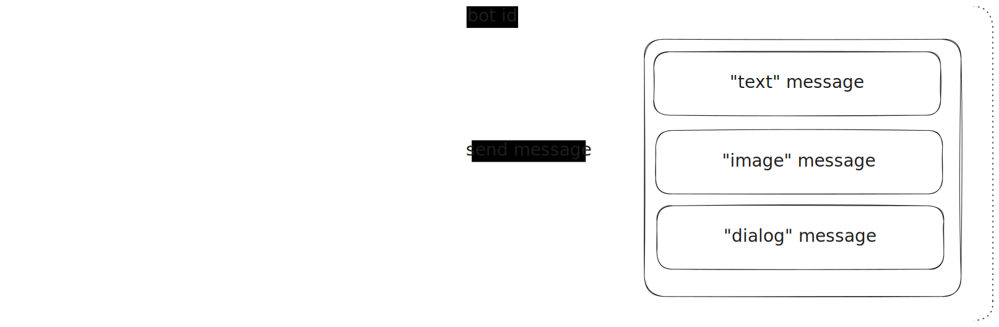
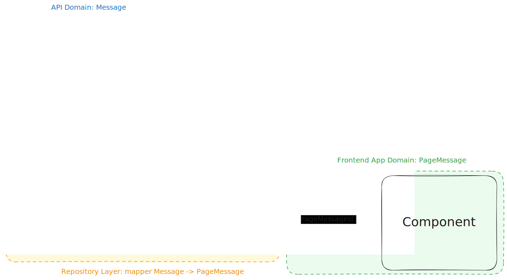
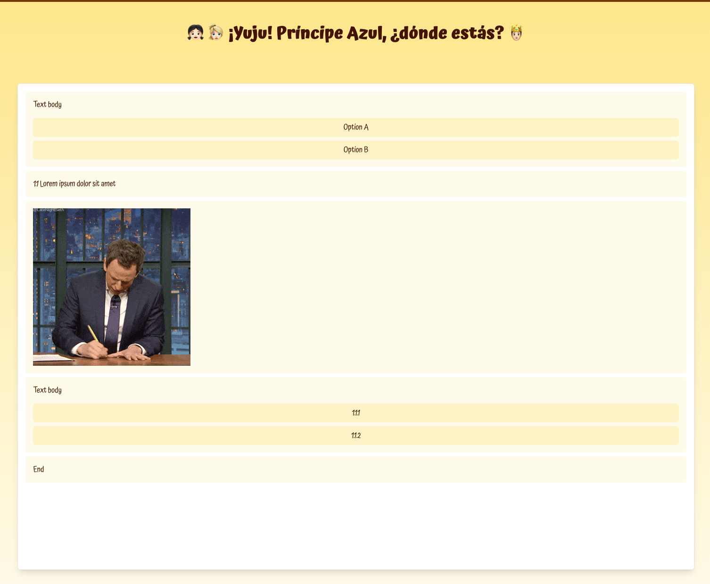
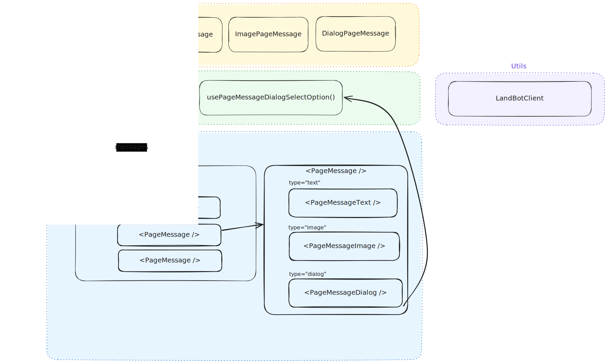

# Children's Book - A dev journal

## First day

When I received the challenge, the first thing that came to mind was, "What the hell am I going to develop?" This challenge offers complete freedom of choice, so I need to find something exciting to work on.

Initially, I considered creating a conversational game, but I quickly realized it would require too much work for a single week, especially since I have two daughters and limited spare time.

Then I remembered some old "choose your own adventure" books I loved as a child. I thought it would be fun to create a digital version of one. However, crafting a story with multiple paths and endings seemed overwhelming, and I'm not a very good writer, so I set that idea aside.

Later that day, while reading a book to my daughters, I thought, "Why not create a digital version of this book?" The book is a simple adaptation of those "choose your own adventure" stories, making it the perfect choice for this challenge. Plus, I won't have to come up with a story since it's already written (I hope I don't get sued for copyright infringement… LOL).

So, that's it. I'm going to develop a digital version of the book ["¡Yuju! Príncipe Azul, ¿dónde estás?" by Sylvie Misslin and Amandine Piu](https://koalaediciones.es/producto/yuju-principe-azul-donde-estas/) (in its Spanish version), using the LandBot builder to create the story paths and interactive choices.

I hope you like it!

## Second day

First day of development, yay!

First things first: read the docs! Fortunately, the challenge documentation is very clear. With that, and the example app, I was quickly able to understand how the `@landbot/core` library should be used (really cool library, by the way, so easy to use).

I spent the previous night thinking about how I would structure the story in the LandBot builder, and how I would implement all the different types of messages in my app. In essence, I would need:

- `text` messages
- `image` messages
- `dialog` messages

The other type of messages (`iframe` and `hidden`) will be discarded, the same way that the "human messages" (those with a positive or undefined `samurai` value) since they are not part of the book and the consumer won't send them explicitly anyways. I gess I will use some kind of whitelist to filter out those messages.

Those "valid" messages will be rendered in a way that resembles a book (I'm not exactly sure how, yet), but in a worst case scenario they can also be rendered top-bottom in a traditional chat way. And depending on the message type, the UI to render them will be different.



This idea will grow and improve as I develop the app, but it's a good starting point. Now I need a starting app to work on: for simplicity I just created a new Vite app. But before starting to code I need to create a new LandBot account and a new bot to work on (well, in fact I had a LandBot account because I created one before applying to the position… ¯\_(ツ)_/¯).

I prefer coding better than photographing the book and copy-pasting the text, so I created a simple flow with the LandBot builder just to have something to start coding. In the following days I'll do the work to create the real flow of the book.

### Disclaimer: file structure

I will explain the file structure I'm using in the project, so you can understand where each part of the code is located.

- `src/App.tsx`: Main component for the app
- `src/components`: React components that are used in the app.
- `src/hooks`: Custom hooks. Since there are not many of them in this project I won't create sub-folders, but usually I like to group them (`api`, `utils`, etc.)
- `src/domain`: the app domain models

You'll notice that I follow a naming pattern on the files, using a `filename.<subclass>` pattern for many files (e.g., `useExample.ts` and `useExample.types.ts`, among others). I leverage this convention by configuring VS Code to enable folding using this pattern:

```json
"explorer.fileNesting.patterns": {
    "*.js": "${capture}.*",
    "*.jsx": "${capture}.*",
    "*.ts": "${capture}.*",
    "*.tsx": "${capture}.*",
},
```

And the result of this config is:


On larger projects, I typically use a "features folder" approach, where each feature is stored in a `src/features` sub-folder. Inside that feature folder, I keep all files related to that specific feature, such as components and hooks. However, since this is a simple project with only one feature, this method is unnecessary.

### Model and repository layer

Well then, let's start coding! I need a model for the messages. I prefer my frontend apps to have their own domain models, which decouples them from the API responses. This approach allows the API responses to change without impacting the frontend code, or at least minimizes the number of affected points. I created a `PageMessage` model to represent the three types of messages I will handle:

```typescript
type TextPageMessage = {
    id: string;
    type: 'text';
    text?: string;
    timestamp: number;
};

type ImagePageMessage = {
    id: string;
    type: 'image';
    text?: string;
    imageUrl: string;
    timestamp: number;
};

type DialogPageMessage = {
    id: string;
    type: 'dialog';
    text?: string;
    options: string[];
    payloads: string[];
    timestamp: number;
};

type PageMessage = TextPageMessage | ImagePageMessage | DialogPageMessage;
```

Then I need a "kind-of-repository" layer to retrieve data from the Landbot service. To achieve this, I created a `usePageMessages()` custom hook that initializes the Landbot core service and subscribes to incoming messages. It returns a list of our app's `PageMessage` domain models. This approach provides a centralized point for accessing messages, allowing us to easily change the message source in the future if necessary.

This hook takes the bot URL as an argument, which is the URL of the bot created in the Landbot builder. This allows us to reuse the hook for different bots as needed.

```typescript
const { messages } = usePageMessages('https://landbot.io/u/H-123456-ABCDEF');
```

To obtain our own domain objects from the hook, we need to convert the data response from Landbot into our domain format. To achieve this, I created a mapper to centralize the conversion code. This way, if the Landbot API changes, we only need to update the mappers, and the hook will continue to return the same domain objects.



Some surprising came along the way: while working on these mappers, I found that the types in the `@landbot/core` package do not align with the documentation in the challenge README file. Specifically, the `url` attribute for messages of type `image` and the `buttons` and `payloads` attributes for messages of type `dialog` are missing from the types. For now, to see the Landbot response "live" and verify if the response includes these fields, I will use a `@ts-expect-error` directive.

After testing: indeed, they are present although the types do not include those attributes. I will keep the `@ts-expect-error` directive for now and ask you about it in the next interview, if it happens.

### Testing

Now that I have the "reading" mechanism set up in `/src/hooks/usePageMessages.ts`, I want to focus on testing it. The first step is to configure a testing library within the project. I chose Vitest because it is the official testing library for Vite. I also installed `@testing-library/react` and `@testing-library/jest-dom` to provide the necessary tools for testing the React components.

Now I can test what I need to. I will start by testing the `usePageMessages` mappers, as it is important that the messages are correctly converted to our domain objects. I will also test the hook itself to ensure that the messages are returned correctly and sorted by timestamp.

Once the tests are complete, I will move on to creating the components to render the different messages. However, that will be tomorrow, as I have two demanding daughters asking me to read them a book. :)

## Third day

Today I will focus on creating the components to render the different types of messages. I will start with a root component which will handle the rendering logic for each message type. This component will receive a `PageMessage` object and render the appropriate component based on the message type.

But before, being a pragmatic programmer as I am, I'm going to install Tailwind for styling. It's not that I don't know how to write CSS, but I find it much faster to use a utility-first CSS framework like Tailwind for small projects like this one.

As seen in previous diagrams, I already have clear in my mind how the components will be structured. I will create a `<PageMessage />` component that will render the different types of messages. This component will receive a `PageMessage` object and render the appropriate component based on the message type.

Those sub-components will be:

- `<PageMessageText />`: for the `text` messages
- `<PageMessageImage />`: for the `image` messages
- `<PageMessageDialog />`: for the `dialog` messages

Since the `dialog` messages are the most complex, and the first one on my LandBot builder URL definition. I will start by creating the `<PageMessageDialog />` component. This component will render the message text and a list of buttons based on the `options` attribute of the `DialogPageMessage` object.

In order to finish this component I need to implement the `sendMessage()` mechanism to tell LandBot that I want to continue the conversation. I will create a `usePageMessageDialogSelectOption()` hook that will send a message to the Landbot service when a button is clicked. This hook will take the bot URL and will return a `selectOption` method to trigger the answer.

Right after implementing the hook and integrating it into the component to send the selected option to LandBot I noticed that it was not working:

- The `sendMessage()` method was being called, but it was throwin an error: `Cannot read properties of undefined (reading 'auth')`
- The subscription to new messages was not receiving any new message

That made me think that I would probably need to use the same instance of the LandBot client in order to make the info exchange under the same auth. Si I must refactor my solution to take this into account.

I dediced to create an utility class to manage the initialization and destroy of the LandBot client, using that utility to store a singleton of each client by storing the clients using the URL of the chatbot in a dictionary (`src/utils/landbot.ts`).


With this mechanism, the read/write operations for the chatbot are working and I can continue with the implementation of the UI components.

While implementing the components, I noticed that I forgot to filter out the messages I didn't want to handle within the app (remember I was going to work with `text`, `dialog` and `image` messages sent by the bot). Because I already have all the logic to manage LandBot messages in my `usePageMessages()` custom hook, I only need to update that file to add the checks for that. Nice!

With the `<PageMessageDialog />` component working, I will now create the `<PageMessageText />` and `<PageMessageImage />` components. These components will be simpler than the dialog component, as they only need to render the text or image of the message.

Once I have all the components created, I will focus on testing them. I will write tests to ensure that the components render the correct content based on the message type. I will also test the components with different message data to ensure that they handle all possible scenarios. I'm not a big fan of TDD, that's why I created the tests later.

And that's it. I have an implementation of the book reader app, with a classic chat style. This version is working with a basic chatbot definition (only a few messages and structure) but I will continue working on it by adding the real flow of messages with the texts from the book to the LandBot builder, using dummy images. Later on, I'll replace those images with the real ones from the book.



A few minutes later, after some struggles with the LandBot builder, I added all the messages from the book. Now, I have a working version of the app that reflects the actual flow of messages. I'm pleased with the result, but I still need to capture and add all the book images to the LandBot builder. I might ask my wife for some help with this. :)

Here is a final diagram of the solution:



## Fourth day

I'm using this day to make the final touches: the real book images (a lot of post-processing, sigh…) and making the UI more _book-alike_.

Regarding this last point, it's just a matter of filtering out the messages returned by my `usePageMessages()` hook, and composing the UI accordingly.


## Final thoughts

I'm happy with the result of this challenge. I created a digital version of the book ["¡Yuju! Príncipe Azul, ¿dónde estás?"](https://koalaediciones.es/producto/yuju-principe-azul-donde-estas/) using the LandBot builder to develop the story paths and interactive choices. The app is functioning well, and I implemented all the features I wanted.

I know there is plenty of room for improvement, but every piece of software can be iterated infinitely. I consider myself a pragmatic person, so I prefer to deliver a working version of the app with acceptable quality and then iterate based on feedback and new requirements.
